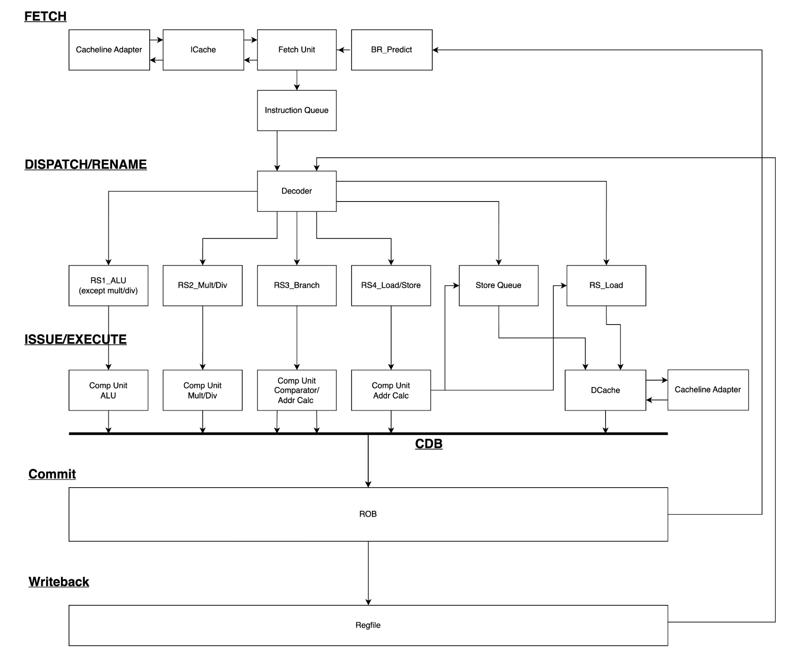
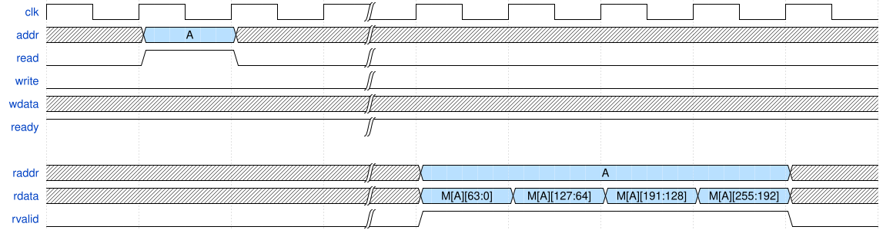
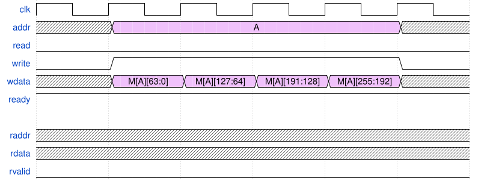

# Out-of-Order RISC-V Processor (RV32IM)

A Tomasulo-style out-of-order RISC-V processor implemented in SystemVerilog. This project supports the **RV32IM** instruction set, executes instructions **out-of-order**, and commits them **in-order** through a reorder buffer (ROB). The design integrates branch prediction, load/store dependency handling, and sequential multiply/divide IP blocks.

## Highlights

- Implemented a **Tomasulo-based out-of-order processor** in SystemVerilog
- Supports the **RV32IM** instruction set
- Designed and integrated:
  - Instruction Queue (IQ)
  - Reservation Stations (RS)
  - Reorder Buffer (ROB)
  - Load/Store Queue (LSQ)
  - Common Data Bus (CDB)
  - Gshare Branch Predictor + BTB
- Improved **CoreMark IPC from ~0.10 to 0.3807**
- Achieved **636.94 MHz** post-synthesis clock frequency
- Verified against benchmark workloads including CoreMark

## Project Overview

The goal of this project was to design a working **out-of-order RISC-V CPU** that can correctly execute the RV32IM instruction set while exploiting instruction-level parallelism. The processor issues instructions dynamically from reservation stations, tracks dependencies using ROB tags, and preserves architectural correctness through in-order commit.

The final design includes:
- Dynamic scheduling
- Register renaming through ROB tag tracking
- Out-of-order execution
- In-order retirement
- Branch prediction
- Out-of-order load handling


<p align="center">  <p
  align="center">Processor Architecture</p> </p>


## Architecture

The processor is organized into the following pipeline stages:

1. **Fetch**
2. **Dispatch / Rename**
3. **Issue / Execute**
4. **Writeback**
5. **Commit**

### Main Hardware Blocks

| Component | Quantity | Depth |
|---|---:|---:|
| Reservation Stations (RS) | 4 | 4 |
| Common Data Bus (CDB) | 4 | N/A |
| Reorder Buffer (ROB) | 1 | 8 |
| Instruction Queue (IQ) | 1 | 16 |
| Load/Store Queue (LSQ) | 2 | 4 |

The processor follows a Tomasulo-like execution model:
- Instructions are fetched and placed into the instruction queue
- Decoded instructions are dispatched to both ROB and RS
- RS entries wait until operands are ready
- Execution completes out-of-order
- ROB enforces in-order commit


## Fetch and Instruction Delivery

The fetch stage initializes the PC to `0x1ECEB000` and increments by 4 for sequential instruction fetch. Instructions are buffered using a **parameterized FIFO-based instruction queue**.

### Parameterized Instruction Queue

The instruction queue is implemented using:
- Head and tail pointers
- Parameterized depth
- FIFO semantics for instruction buffering

This parameterized structure was also reused in later modules such as the ROB and store queue.


```systemverilog
module instruction_queue #(
  parameter IQ_DEPTH = 4,
  parameter IQ_WIDTH = 32
)
```
**Example of parameterized array**
```systemverilog
  logic [(IQ_WIDTH - 1):0] instr_arr[IQ_DEPTH];
  logic [(IQ_WIDH - 1):0] pc_arr[IQ_DEPTH];
  logic [(IQ_WIDTH - 1):0] pc_next_arr[IQ_DEPTH];
  logic [(IQ_WIDTH - 1):0] valid_arr[IQ_DEPTH];
```

### Cacheline Adapter

DRAM data burst behavior is described by the following timing diagram. To interface the DRAM with the 256-bit cacheline, a cacheline adapter is required to handle the data read and write into the DRAM from the cacheline. 


<p align="center">  <p
  align="center">DRAM single read</p> </p>

<p align="center">  <p
  align="center">DRAM single write</p> </p>

The cacheline adapter contains a counter that counts 4 cycles for each 64 bits data burst to ensure all 256 bits are collected from the DRAMA counter. Likewise, when writing 256 bits from the cacheline into the DRAM, the counter also ensure all 256 bits are written into the DRAM in 4 consecutive clock cycles.

For instruction cache, the 256-bit data read from the cache will be used to fetch 8 instructions consecutively.


## Out-of-Order Execution

Out-of-order execution is handled in the **Reservation Stations**.

After decode:
- Instructions are sent to the ROB and RS
- RS receives destination tags from the ROB tail
- Source operands are tracked using tags and valid bits
- Instructions issue when operands become ready

Execution units include:
- ALU
- Multiply / Divide
- Load / Store
- Branch / Comparator

The **Common Data Bus (CDB)** broadcasts execution results so dependent instructions can wake up.

Because the ROB is FIFO-ordered, instructions may complete out-of-order but still **commit in program order** by looking into their corresponding ```commit_ready``` bit. The instruction can only be commited if it is at the head positon in the ROB and its ```commit_ready``` bit is high.  


## Multiply / Divide Integration

Sequential Synopsys IPs were used for multiplication and division.

Reasons for choosing the sequential IPs:
- Configurable `rst_mode`
- Configurable `input_mode`
- Configurable `tc_mode` for signed/unsigned operations
- Adjustable computation latency for timing tradeoffs

This made it easier to:
- Match pipeline behavior
- Handle flushes
- Control timing complexity

The number of cycles used for multiply and divide IP are set to the maximum allowed cycles in order to operate at higher clock frequency. 
<p align="center">  <p
  align="center">Multiply IP timing diagram</p> </p>
<p align="center">  <p
  align="center">Divide IP timing diagram</p> </p>

## Load / Store Design

In the original design, a single LSQ handled both load and store instructions. This introduced unnecessary stalls because loads had to wait even when they were independent of older stores.

To improve performance, the LSQ was split into:
- A **store queue**
- A **load reservation station**

### Out-of-Order Load Support

With the split design:
- Loads first check for older stores they may depend on
- If no dependency exists, they may execute out-of-order
- A special edge case is handled when a load arrives while a store is finishing commit

In addition, the cache is pipelined. This significantly improves the IPC for nearly 4x compared to the original design with combined LSQ and non-pipelined cache .

<!-- TODO: Insert out-of-order load waveform here -->
<!-- Example:

-->

## Branch Prediction

The design uses a **Gshare branch predictor** combined with a **Branch Target Buffer (BTB)**.

This approach was chosen because it:
- Is relatively simple to implement
- Reduces aliasing by XORing PC bits with branch history
- Reduces unnecessary pipeline flushes

A major improvement observed in the project was the reduction in flush count:
- **Before predictor improvement:** about 33,000 flushes
- **After predictor improvement:** about 11,000 flushes

<!-- TODO: Insert branch predictor / flush reduction graph here -->
<!-- Example:

-->

## Results

The initial out-of-order design passed local functional tests but suffered from poor IPC due to cache misses and limited memory performance. After introducing branch prediction, out-of-order load support, and pipelined cache usage, performance improved substantially.

### Final Reported Metrics

- **CoreMark IPC:** 0.3807
- **Clock Frequency:** 636.94 MHz
- **Area:** 182,619 µm²

### Benchmark IPC Summary

| Benchmark | IPC |
|---|---:|
| CoreMark | 0.3807 |
| AES/SHA | 0.3130 |
| CNN | 0.2680 |
| Compression | 0.4997 |
| FFT | 0.3684 |
| Mergesort | 0.4716 |
| Raytracing | 0.1834 |
| RSA | 0.1977 |

<!-- TODO: Insert initial results screenshot/table here -->
<!-- Example:

-->

<!-- TODO: Insert final results screenshot/table here -->
<!-- Example:

-->

## Design Tradeoffs and Limitations

Two major remaining improvement opportunities were identified.

### 1. Single-Cycle Load / Store on Cache Hit

The memory subsystem currently uses multiple states for both load and store operations:
- IDLE
- LOAD / STORE
- DONE

This makes the design functionally correct, but inefficient. In an ideal cache-hit case, the processor could approach **1-cycle load/store**, which would significantly increase IPC.

However, achieving that would require much more complex coordination between:
- ROB
- LSQ
- Cache interface

### 2. Branch Recovery

Although branch prediction reduced flushes significantly, branch recovery is still incomplete and remains an important future improvement area.

The design also intentionally kept the ROB relatively small to reduce flush penalties.

<!-- TODO: Insert LSQ FSM figure here -->
<!-- Example:

-->

## Future Work

Potential next steps include:
- Single-cycle load/store under hit conditions
- More complete branch recovery
- Better memory system optimization
- Wider issue / superscalar support
- More advanced branch prediction
- Further IPC optimization for benchmark workloads

## Repository Structure

```text
.
├── rtl/
│   ├── fetch/
│   ├── rob/
│   ├── rs/
│   ├── lsq/
│   ├── execute/
│   └── common/
├── testbench/
├── docs/
│   └── figures/
└── README.md